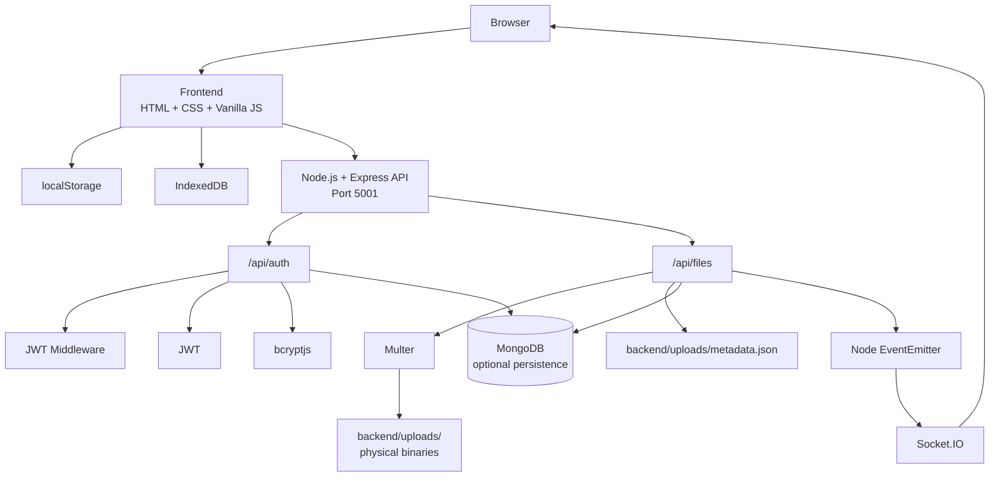
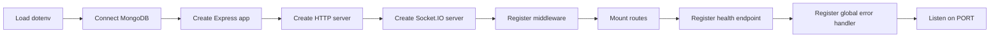
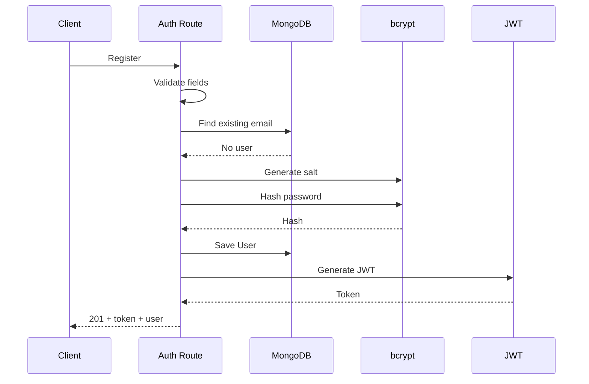
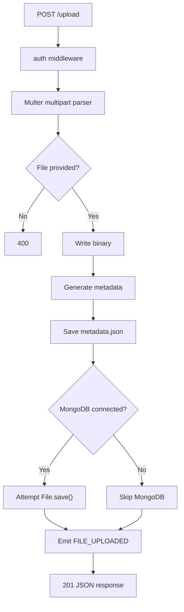
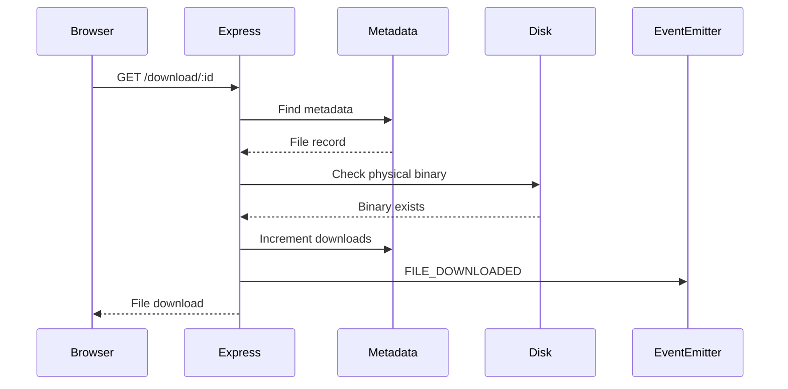

# ☁️ CloudShare — Technical Documentation

## 1. Project Overview

CloudShare is a browser-based file-sharing application created as a full-stack learning/demo project.

The application combines:

- a static web frontend;
- a Node.js + Express backend;
- optional MongoDB persistence;
- local filesystem storage;
- JSON metadata persistence;
- browser localStorage;
- browser IndexedDB;
- JWT authentication;
- bcrypt password hashing;
- Multer file uploads;
- Socket.IO real-time events.

The project is intentionally lightweight and does not require React, a frontend build pipeline, Redis, Kafka, S3, or another cloud infrastructure service.

---

# 2. System Goals

The project demonstrates a complete file-sharing workflow:

```text
User
 ↓
Open application
 ↓
Login / Register
 ↓
Dashboard
 ↓
Upload file
 ↓
Store binary + metadata
 ↓
Organize / search / star
 ↓
Generate share link
 ↓
Download
 ↓
Track download count
 ↓
Delete when no longer needed
```

It also demonstrates how server-side events can be propagated to browser clients through Socket.IO.

---

# 3. Important Architecture Clarification

CloudShare should **not** be described as an enterprise cloud-storage platform in its current state.

The actual implementation is a hybrid demo architecture:

```text
Frontend browser state
        +
Express backend
        +
Local filesystem
        +
JSON metadata
        +
Optional MongoDB
        +
Socket.IO events
```

Some UI text suggests capabilities such as AES-256 encryption, end-to-end encryption, 10 GB uploads, CDN distribution, chunked uploads, and expiring secure links. Those capabilities are **not implemented end-to-end in the current source**.

The technical documentation therefore distinguishes between:

- **implemented behavior**, and
- **product-style/demo UI claims or future capabilities**.

---

# 4. High-Level Architecture



---

# 5. Repository Structure

```text
FileSharingApp/
├── backend/
│   ├── config/
│   │   └── db.js
│   ├── events/
│   │   └── fileEvents.js
│   ├── middleware/
│   │   └── auth.js
│   ├── models/
│   │   ├── User.js
│   │   └── File.js
│   ├── routes/
│   │   ├── auth.js
│   │   └── files.js
│   ├── uploads/
│   │   └── metadata.json
│   ├── index.js
│   ├── package.json
│   └── package-lock.json
│
├── frontend/
│   ├── index.html
│   ├── login.html
│   ├── register.html
│   ├── dashboard.html
│   ├── share.html
│   ├── download.html
│   ├── app.js
│   └── style.css
│
├── README.md
└── DOCUMENTATION.md
```

---

# 6. Technology Stack

## Frontend

### HTML5

Separate static pages provide:

- landing page;
- login;
- registration;
- dashboard;
- sharing;
- downloading.

### CSS

Custom styling is contained in:

```text
frontend/style.css
```

### Vanilla JavaScript

The main application behavior is centralized in:

```text
frontend/app.js
```

### Bootstrap

The application uses Bootstrap 5.3 through CDN resources for layout and UI components.

### Bootstrap Icons

File-type and interface icons come from Bootstrap Icons.

---

## Backend

### Node.js

Provides the runtime for the server.

### Express

Handles:

- middleware;
- REST routes;
- static upload serving;
- JSON responses;
- health checks;
- global error handling.

### Multer

Processes:

```text
multipart/form-data
```

for file uploads and writes files to disk.

### Mongoose

Provides MongoDB connectivity and models.

### bcryptjs

Hashes and verifies user passwords.

### jsonwebtoken

Generates and verifies JWTs.

### Socket.IO

Provides real-time browser communication.

### dotenv

Loads environment configuration.

---

# 7. Backend Entry Point

Source:

```text
backend/index.js
```

The startup flow is:



The default port is:

```text
5000
```

but the README/frontend development flow uses:

```text
5001
```

for the current local setup.

Therefore, when running the project with the supplied frontend, it is recommended to explicitly configure:

```env
PORT=5001
```

---

# 8. Express Middleware

The server registers:

```javascript
app.use(cors());
app.use(express.json());
app.use(express.urlencoded({ extended: true }));
```

It also exposes:

```text
/uploads
```

as a static directory mapped to:

```text
backend/uploads/
```

### Implication

A physical uploaded file can potentially be directly served through the static `/uploads` path if its URL is known.

A production application should normally place access control in front of protected files rather than exposing an upload directory directly.

---

# 9. Authentication Architecture

Source:

```text
backend/routes/auth.js
backend/middleware/auth.js
backend/models/User.js
```

The authentication design has two layers:

```text
Frontend demo authentication
        +
Backend JWT authentication
```

These layers are currently not completely connected.

---

# 10. User Model

The Mongoose user schema contains:

```text
name
email
password
createdAt
updatedAt
```

### Email

- required;
- unique.

### Password

- required;
- stored as a bcrypt hash after registration.

### Timestamps

Mongoose automatically maintains:

```text
createdAt
updatedAt
```

---

# 11. Registration Flow

Endpoint:

```text
POST /api/auth/register
```

Request:

```json
{
  "name": "John Doe",
  "email": "john@example.com",
  "password": "Password123!"
}
```

Processing:



### Validation

The route checks:

```text
name
email
password
```

If a field is missing:

```text
HTTP 400
```

If the email already exists:

```text
HTTP 400
```

---

# 12. Login Flow

Endpoint:

```text
POST /api/auth/login
```

Request:

```json
{
  "email": "john@example.com",
  "password": "Password123!"
}
```

Processing:

```text
Find user by lowercase email
        ↓
Compare supplied password with bcrypt hash
        ↓
Generate JWT
        ↓
Return user + token
```

Wrong credentials produce:

```text
HTTP 400
Invalid email or password
```

---

# 13. JWT Structure

The authentication route signs a payload containing:

```json
{
  "id": "<user_id>",
  "name": "<name>",
  "email": "<email>"
}
```

Expiry:

```text
7 days
```

The signing secret is read from:

```env
JWT_SECRET
```

with a source-code fallback.

### Production recommendation

Never rely on the fallback secret in production.

Use a strong environment-provided secret.

---

# 14. Authentication Middleware

Source:

```text
backend/middleware/auth.js
```

The middleware reads:

```http
Authorization: Bearer <token>
```

It then attempts:

```text
jwt.verify(...)
```

### Important demo behavior

When there is:

- no token, or
- an invalid token,

the middleware assigns a demo user:

```text
Guest User / Demo User
```

and continues.

This is why the current upload/list routes can still operate without a valid backend login.

### Production behavior

A production middleware should instead return:

```text
401 Unauthorized
```

for missing/invalid authentication.

---

# 15. Current Frontend Authentication

The frontend has a separate simulated authentication system in `frontend/app.js`.

It stores:

```text
cloudshare_user
cloudshare_token
```

in:

```text
localStorage
```

The login form does not call:

```text
POST /api/auth/login
```

Instead it creates a local browser session after a short UI delay.

The registration form similarly creates a local session without calling:

```text
POST /api/auth/register
```

### Consequence

There are currently two partially independent authentication flows:

```text
Frontend form
    ↓
localStorage session

Backend API
    ↓
MongoDB + JWT
```

They are not yet fully synchronized.

---

# 16. File Model

Source:

```text
backend/models/File.js
```

The MongoDB File document contains:

```text
filename
originalName
path
size
mimetype
category
owner
isStarred
isPublic
downloads
permissions
status
createdAt
updatedAt
```

---

# 17. File Model Details

## filename

Server-side stored filename.

Example conceptual format:

```text
f-<generated-id>___safe-original-name.pdf
```

## originalName

Original name supplied by the client.

## path

Physical server-side path.

## size

File size in bytes.

## mimetype

MIME type from upload metadata.

## category

One of:

```text
documents
images
media
archives
other
```

## owner

MongoDB ObjectId reference to `User`.

## isStarred

Boolean flag.

## isPublic

Boolean public/private flag.

## downloads

Numeric download counter.

## permissions

Array of:

```text
user
access
```

where access is:

```text
read
write
```

## status

Allowed values:

```text
uploading
available
failed
```

### Important

These fields exist in the data model, but current API handlers do not consistently enforce:

- owner isolation;
- public/private rules;
- read/write permissions.

---

# 18. File Storage Architecture

CloudShare uses a hybrid storage design.

```text
Uploaded file
      ↓
backend/uploads/
      +
backend/uploads/metadata.json
      +
optional MongoDB File document
```

### Why JSON metadata exists

The file route explicitly loads and saves:

```text
metadata.json
```

This allows the application to function with local metadata even if MongoDB is unavailable.

---

# 19. Metadata Synchronization at Startup

The file route contains a startup synchronization function.

Conceptually:

```text
Read metadata.json
       ↓
Read files from backend/uploads/
       ↓
Find files missing from metadata
       ↓
Generate metadata records
       ↓
Write updated metadata.json
```

This helps recover metadata for files that already exist on disk.

For files without known metadata, the application infers:

- filename;
- original name;
- file ID;
- file size;
- MIME type;
- category.

---

# 20. Upload Filename Generation

Multer uses disk storage.

The upload process creates a generated ID:

```text
f-<timestamp/random component>
```

The original filename is sanitized:

```text
[^a-zA-Z0-9._-]
```

is replaced with:

```text
_
```

The final physical filename is:

```text
<fileId>___<safeName>
```

This reduces the chance of unsafe path characters becoming part of the stored filename.

---

# 21. Upload Size Limit

The current backend configuration is:

```javascript
limits: {
  fileSize: 500 * 1024 * 1024
}
```

Therefore:

```text
500 MB per uploaded file
```

is the real backend limit.

Some frontend marketing text displays:

```text
2 GB
```

or:

```text
10 GB
```

but those values are not the backend enforcement limit.

---

# 22. File Categorization Algorithm

The backend determines categories using filename extensions and MIME types.

### Documents

```text
pdf
doc
docx
txt
rtf
odt
xls
xlsx
ppt
pptx
csv
```

### Images

```text
jpg
jpeg
png
gif
svg
webp
```

### Media

```text
mp4
mov
avi
mkv
mp3
wav
flac
```

### Archives

```text
zip
rar
tar
gz
7z
iso
```

Everything else:

```text
other
```

---

# 23. Upload API

Endpoint:

```text
POST /api/files/upload
```

Request:

```text
Content-Type: multipart/form-data
```

Required field:

```text
file
```

Processing:



Successful response:

```json
{
  "message": "File uploaded successfully",
  "file": {
    "id": "...",
    "originalName": "...",
    "size": 12345,
    "category": "documents"
  }
}
```

---

# 24. List Files API

Endpoint:

```text
GET /api/files
```

The route:

1. Loads metadata.
2. Converts metadata records to an array.
3. Sorts newest first.
4. Returns all file metadata.

### Important limitation

The current route does **not** filter the returned files by the authenticated user's owner ID.

Therefore the endpoint is not true multi-user isolation.

---

# 25. File Details API

Endpoint:

```text
GET /api/files/:id
```

This endpoint is public.

The lookup first checks the metadata map directly.

If not found, it attempts matching by:

```text
stored filename
```

or:

```text
original filename
```

Possible result:

```text
200 → file found
404 → file not found
500 → server error
```

---

# 26. Download API

Endpoint:

```text
GET /api/files/download/:id
```

The handler:

1. Finds the metadata entry.
2. Attempts to locate the physical file.
3. Falls back to scanning the upload directory.
4. Increments the metadata download counter.
5. Emits `FILE_DOWNLOADED`.
6. Sends the file with Express `res.download()`.



---

# 27. Delete API

Endpoint:

```text
DELETE /api/files/:id
```

The current route:

1. Loads metadata.
2. Finds the record.
3. Deletes the physical file if it exists.
4. Deletes metadata.
5. Attempts MongoDB deletion when applicable.
6. Returns success.

### Important security issue

The route currently does not verify that:

```text
requester == file.owner
```

Therefore ownership is not enforced.

A production implementation must perform an authorization check before deletion.

---

# 28. Event-Driven Design

Source:

```text
backend/events/fileEvents.js
```

CloudShare uses:

```javascript
EventEmitter
```

to provide an internal event bus.

Current event types:

```text
FILE_UPLOADED
FILE_DOWNLOADED
FILE_DELETED
```

These events are logged and then bridged to Socket.IO.

---

# 29. Socket.IO Architecture

The backend creates:

```text
Socket.IO Server
```

on the same HTTP server as Express.

A browser client can establish a Socket.IO connection.

The server supports:

```text
join-user-room
```

with room name:

```text
user_<userId>
```

This allows targeted notifications.

---

# 30. Event Bridge

### Upload

```text
FILE_UPLOADED
      ↓
io.emit("file:uploaded", data)
      +
io.to(user_<id>).emit("user:file:uploaded", data)
```

### Download

```text
FILE_DOWNLOADED
      ↓
io.emit("file:downloaded", data)
```

### Delete

```text
FILE_DELETED
      ↓
io.emit("file:deleted", data)
      +
io.to(user_<id>).emit("user:file:deleted", data)
```

This design allows the backend to generate domain events independently of how the frontend consumes them.

---

# 31. Frontend Application Architecture

Source:

```text
frontend/app.js
```

The file is organized into logical frontend modules:

```text
APP_CONFIG
Utils
Toast UI
Auth
FileBinaryStore
FileStore
Dashboard
Authentication form handlers
Page initialization
```

---

# 32. APP_CONFIG

The frontend configuration includes:

```javascript
API_BASE_URL: "http://localhost:5001/api"
```

and a displayed storage quota:

```text
50 GB
```

LocalStorage keys:

```text
cloudshare_user
cloudshare_token
cloudshare_files_db
```

---

# 33. Utility Functions

The `Utils` object contains helpers for:

### Formatting file sizes

```text
B
KB
MB
GB
TB
```

### Formatting dates

Uses JavaScript locale formatting.

### Categorizing files

Mirrors the backend's broad category rules.

### File icons

Maps file extensions to Bootstrap Icons.

### ID generation

Creates frontend IDs using random base-36 data.

---

# 34. IndexedDB Architecture

The frontend creates:

```text
CloudShareDB
```

with object store:

```text
blobs
```

The blob key is the file ID.

The system exposes:

```text
saveBlob(id, blob)
getBlob(id)
```

This allows the browser to retain uploaded binary data separately from localStorage metadata.

### Why IndexedDB is used

`localStorage` is useful for small JSON state, but file binaries are better suited to IndexedDB.

The project therefore separates:

```text
Metadata → localStorage
Binary blobs → IndexedDB
```

---

# 35. Local File Store

The frontend keeps dashboard metadata in:

```text
cloudshare_files_db
```

The local store supports:

```text
getFiles()
saveFiles()
addFile()
deleteFile()
toggleStar()
renameFile()
getStats()
```

The initial dashboard contains sample files for immediate UI richness.

---

# 36. Dashboard Rendering

The dashboard supports:

```text
All
Documents
Images
Media
Archives
Starred
```

and:

```text
Grid view
List view
```

The code also provides:

```text
filename search
```

and dashboard statistics.

---

# 37. Backend Synchronization

When the dashboard initializes:

```text
render local state
       ↓
GET /api/files
       ↓
merge server files into local file list
       ↓
render dashboard again
```

If the backend cannot be reached, the frontend logs an offline message and continues with its local browser data.

### Consequence

Frontend and backend state can diverge.

Example:

```text
Browser localStorage
        ≠
metadata.json
        ≠
MongoDB
```

This is an important limitation of the current demo architecture.

---

# 38. Frontend Upload Flow

The dashboard's dropzone supports:

- drag enter;
- drag over;
- drag leave;
- drop;
- file-picker selection.

The UI displays a simulated progress animation.

Important detail:

The displayed progress value is generated by the frontend timer and is **not a true byte-level upload progress measurement from the network transfer**.

---

# 39. Frontend Upload Pipeline

The browser:

```text
Select file
    ↓
Show simulated progress
    ↓
POST /api/files/upload
    ↓
Try backend upload
    ↓
Create local metadata object
    ↓
Save actual File/Blob into IndexedDB
    ↓
Save metadata to localStorage
    ↓
Refresh dashboard
```

The backend response ID is preferred when available.

---

# 40. Frontend Download Pipeline

The download method attempts:

```text
1. Backend HTTP download
2. IndexedDB binary
3. Generated demo fallback content
```

This fallback-first design helps the UI remain demonstrable when the backend is offline or when a sample item does not have a real server-side binary.

### Important

The generated fallback files are **demo content**, not copies of the original uploaded binary.

---

# 41. Share Link Generation

The frontend creates:

```text
/share.html?id=<fileId>&name=<urlEncodedName>
```

The link is shown inside a Bootstrap modal.

The user can:

- copy the link;
- open the shared page.

The link itself is a normal URL containing query parameters.

It is not currently:

- signed;
- encrypted;
- access-controlled;
- expiring.

---

# 42. Shared File Page

Source:

```text
frontend/share.html
```

The page:

1. Reads `id` and `name`.
2. Looks in localStorage.
3. If necessary, queries:
   ```text
   GET /api/files/:id
   ```
4. Displays:
   - name;
   - size;
   - date;
   - icon.
5. Calls:
   ```text
   GET /api/files/download/:id
   ```
   when the download button is clicked.

---

# 43. `download.html`

The page is a compatibility redirect.

It forwards:

```text
download.html?<query>
```

to:

```text
share.html?<query>
```

This keeps older/shared URLs functional while using the newer shared-file page.

---

# 44. Backend Database Connection

Source:

```text
backend/config/db.js
```

Accepted environment variables:

```text
MONGODB_URI
MONGO_URI
```

Fallback:

```text
mongodb://localhost:27017/filesharingapp
```

The Mongoose connection explicitly uses:

```text
dbName: FileSharingApp
```

and has a server selection timeout.

### Optional persistence behavior

The backend attempts the MongoDB connection at startup, but logs the connection failure instead of terminating the application.

Therefore:

```text
MongoDB available
    → DB-backed features can persist

MongoDB unavailable
    → file metadata can still operate through metadata.json
    → physical uploads can still exist on disk
```

---

# 45. Data Persistence Comparison

| Data | Frontend | JSON | MongoDB | Filesystem |
|---|---|---|---|---|
| User login state | ✅ localStorage | — | — | — |
| Dashboard file metadata | ✅ localStorage | — | — | — |
| File binary | ✅ IndexedDB | — | — | ✅ uploads |
| User account | — | — | ✅ | — |
| File document | — | — | ✅ optional | — |
| Download counter | ✅ local copy | ✅ | schema exists | — |

This split is useful for understanding why the current system may show different state across layers.

---

# 46. API Reference

Base URL:

```text
http://localhost:5001/api
```

---

## Authentication API

### Register

```http
POST /auth/register
Content-Type: application/json
```

Body:

```json
{
  "name": "John Doe",
  "email": "john@example.com",
  "password": "Password123!"
}
```

Success:

```text
201 Created
```

Response contains:

```text
message
token
user
```

---

### Login

```http
POST /auth/login
Content-Type: application/json
```

Body:

```json
{
  "email": "john@example.com",
  "password": "Password123!"
}
```

Success:

```text
200 OK
```

---

### Current User

```http
GET /auth/me
Authorization: Bearer <token>
```

Returns:

```json
{
  "user": {
    "_id": "...",
    "name": "John Doe",
    "email": "john@example.com"
  }
}
```

Password is excluded from this response.

---

# 47. File API

## Upload

```http
POST /files/upload
Content-Type: multipart/form-data
Authorization: Bearer <token>
```

Field:

```text
file
```

Maximum size:

```text
500 MB
```

---

## List

```http
GET /files
Authorization: Bearer <token>
```

Returns an array:

```json
{
  "files": []
}
```

---

## Details

```http
GET /files/:id
```

Returns:

```json
{
  "file": {}
}
```

---

## Download

```http
GET /files/download/:id
```

Returns the physical file using:

```text
Content-Disposition
```

through Express's `res.download()` behavior.

---

## Delete

```http
DELETE /files/:id
Authorization: Bearer <token>
```

Returns:

```json
{
  "message": "File deleted successfully",
  "fileId": "..."
}
```

---

# 48. Health API

```http
GET /health
```

Example:

```json
{
  "status": "ok",
  "message": "CloudShare File Sharing API is running",
  "timestamp": "..."
}
```

---

# 49. HTTP Status Summary

| Status | Meaning |
|---|---|
| `200` | Request succeeded |
| `201` | User/file successfully created |
| `400` | Invalid or incomplete request |
| `404` | Requested resource not found |
| `500` | Unexpected server-side error |

Because the current auth middleware uses a demo fallback, missing/invalid authentication does not always result in `401`.

---

# 50. Security Analysis

## Implemented

### Password hashing

Passwords are hashed with:

```text
bcryptjs
```

### JWT

Backend APIs generate and verify JWTs.

### Filename sanitization

Stored filenames replace disallowed characters.

### MIME/category handling

The server attempts to classify uploads by extension and MIME type.

---

## Security gaps

### 1. Authentication bypass behavior

Invalid/missing JWTs fall back to a demo identity.

### 2. Public file access

Details and download endpoints do not require authentication.

### 3. No ownership enforcement

A user can potentially delete a file without ownership verification.

### 4. Permission model not enforced

The schema has:

```text
isPublic
permissions
access = read/write
```

but route handlers do not consistently validate them.

### 5. Permissive CORS

The current server allows all origins.

### 6. Fallback secrets

Source code includes fallback JWT secrets.

### 7. No encryption layer

There is no actual AES-256 end-to-end encryption pipeline.

### 8. Static upload exposure

The upload directory is mounted as a static Express path.

### 9. No antivirus/content inspection

Uploaded files are not scanned for malware.

### 10. No rate limiting

The APIs do not currently implement rate limiting.

---

# 51. Troubleshooting

## Backend does not start

Check:

```bash
node --version
npm --version
```

Then:

```bash
cd backend
npm install
npm start
```

---

## MongoDB connection error

Check:

```text
MONGODB_URI
```

or:

```text
MONGO_URI
```

For local MongoDB:

```text
mongodb://localhost:27017/filesharingapp
```

The process may still start even if MongoDB is unavailable.

---

## Frontend cannot upload

Check:

```text
http://localhost:5001/api/health
```

Then confirm:

```text
API_BASE_URL = http://localhost:5001/api
```

inside:

```text
frontend/app.js
```

Also confirm the selected file is:

```text
≤ 500 MB
```

---

## Shared download fails

Try opening:

```text
GET /api/files/:id
```

first.

Then verify the physical file exists under:

```text
backend/uploads/
```

---

## Dashboard and server files differ

This is expected in the current design because:

```text
localStorage
IndexedDB
metadata.json
MongoDB
```

can contain different state.

---

# 52. Recommended Development Workflow

For a simple local evaluation:

```text
1. Configure .env
2. Start MongoDB if persistence is desired
3. Start backend
4. Check /api/health
5. Serve frontend
6. Open index.html
7. Open dashboard
8. Upload test file
9. Verify backend/uploads/
10. Verify metadata.json
11. Test download
12. Test share link
13. Test delete
```

---

# 53. Suggested Demo / Viva Flow

A five-minute demonstration can be presented as:

### Step 1 — Landing Page

Explain:

- frontend uses vanilla JavaScript;
- Bootstrap provides UI;
- application is browser based.

### Step 2 — Login/Register

Explain:

- UI flow is simulated;
- backend separately provides JWT-based authentication.

### Step 3 — Dashboard

Show:

- grid/list views;
- search;
- category filters;
- starred files.

### Step 4 — Upload

Explain:

```text
Browser
 → Express
 → Multer
 → backend/uploads
 → metadata.json
 → optional MongoDB
 → event notification
```

### Step 5 — Share

Generate:

```text
/share.html?id=...
```

Explain that the current system uses a simple query-parameter link.

### Step 6 — Download

Explain:

```text
Backend binary
 → response
 → browser download
```

and mention the IndexedDB fallback.

### Step 7 — Real-Time

Explain:

```text
File Route
 → EventEmitter
 → Socket.IO
 → Browser
```

### Step 8 — Security Limitation

Conclude honestly:

> “This is a learning/demo system. The next production step would be strict JWT enforcement, ownership checks, permission validation, signed expiring links, encryption, object storage, and security hardening.”

---

# 54. Production Architecture Proposal

The current architecture:

```text
Browser
   ↓
Express
   ├── local filesystem
   ├── JSON metadata
   └── optional MongoDB
```

A more production-oriented architecture could be:

```text
Browser
   ↓
HTTPS
   ↓
API Gateway / Load Balancer
   ↓
Node.js File Service
   ├── Authentication Service
   ├── PostgreSQL / MongoDB
   ├── S3 / MinIO Object Storage
   ├── Redis
   ├── Queue / Event Bus
   └── Audit / Monitoring
```

---

# 55. Production File Upload Flow

```text
Client
   ↓
Authenticated upload request
   ↓
Validation
   ↓
Virus / content scanning
   ↓
Object storage
   ↓
Database metadata
   ↓
Audit event
   ↓
Signed access URL
```

---

# 56. Production Sharing Model

Instead of:

```text
/share.html?id=fileId
```

use:

```text
/share/<random-token>
```

where the token:

- is cryptographically random;
- has an expiration;
- may have download limits;
- is stored server-side;
- can be revoked.

---

# 57. Production Authorization Model

Every file operation should follow:

```text
Authenticate user
       ↓
Find file
       ↓
Check ownership
       ↓
Or check explicit permission
       ↓
Allow / deny
```

Example:

```text
Owner
 ├── read
 ├── write
 └── delete

Shared user
 ├── read
 └── optional write

Unauthenticated
 └── only if file is explicitly public
```

---

# 58. Production Encryption

The current project should not claim actual end-to-end encryption.

A genuine implementation could introduce:

```text
Client-side encryption
       ↓
Encrypted blob
       ↓
Object storage
       ↓
Decryption key controlled by client
```

or a controlled server-side encryption strategy using:

```text
AES-GCM
+
secure key management
```

The key-management model should be documented separately because encryption without secure key handling does not provide meaningful end-to-end security.

---

# 59. File-Level Technical Map

| File | Main responsibility |
|---|---|
| `backend/index.js` | Application bootstrap, Express, Socket.IO |
| `backend/config/db.js` | MongoDB connection |
| `backend/events/fileEvents.js` | Internal event emitter |
| `backend/middleware/auth.js` | JWT middleware |
| `backend/models/User.js` | User model |
| `backend/models/File.js` | File model |
| `backend/routes/auth.js` | Auth endpoints |
| `backend/routes/files.js` | File endpoints |
| `backend/uploads/metadata.json` | Local metadata |
| `frontend/index.html` | Landing page |
| `frontend/login.html` | Login page |
| `frontend/register.html` | Registration page |
| `frontend/dashboard.html` | Dashboard UI |
| `frontend/share.html` | Share/download page |
| `frontend/download.html` | Redirect page |
| `frontend/app.js` | Main frontend controller/store logic |
| `frontend/style.css` | Custom presentation |

---

# 60. Current Feature Matrix

| Feature | Current status |
|---|---|
| User registration API | ✅ |
| User login API | ✅ |
| JWT generation | ✅ |
| bcrypt password hashing | ✅ |
| Protected profile API | ✅ |
| File upload | ✅ |
| 500 MB backend upload limit | ✅ |
| Disk storage | ✅ |
| JSON metadata | ✅ |
| Optional MongoDB file persistence | ✅ |
| File listing | ✅ |
| File details | ✅ |
| File download | ✅ |
| File deletion | ✅ |
| Search | ✅ frontend |
| Categories | ✅ |
| Starred files | ✅ frontend |
| Rename | ✅ frontend/local only |
| Share links | ✅ frontend |
| Socket.IO | ✅ |
| Internal file events | ✅ |
| Per-user Socket.IO room support | ✅ |
| Strict authentication | ❌ |
| Ownership enforcement | ❌ |
| Complete permission enforcement | ❌ |
| Expiring share links | ❌ |
| Password-protected links | ❌ |
| Real E2E encryption | ❌ |
| Virus scanning | ❌ |
| Rate limiting | ❌ |
| Resumable/chunked upload | ❌ |

---

# 61. Final Technical Summary

CloudShare is best understood as:

> **A browser-based file-sharing demo with a Vanilla JavaScript frontend, an Express/Multer backend, local filesystem + JSON metadata storage, optional MongoDB persistence, JWT/bcrypt authentication APIs, and Socket.IO-based real-time file events.**

The most important technical flow is:

```text
User
 ↓
Frontend
 ↓
Express
 ↓
Multer
 ↓
Physical upload
 +
Metadata JSON
 +
Optional MongoDB
 ↓
EventEmitter
 ↓
Socket.IO
 ↓
Connected clients
```

The main engineering strengths of the project are:

```text
Clean separation between frontend/backend
        +
Real file upload handling
        +
Optional database persistence
        +
JWT authentication implementation
        +
Browser-side IndexedDB fallback
        +
Real-time event bridge
```

The main areas for future hardening are:

```text
Strict authentication
        +
Authorization
        +
Ownership validation
        +
Secure share links
        +
Encryption
        +
Object storage
        +
Rate limiting
        +
Malware scanning
        +
Production secret management
```

---

## Related File

[Back to README](README.md)
