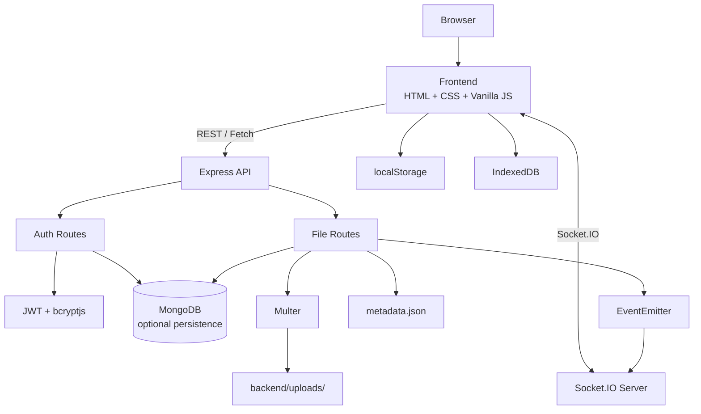
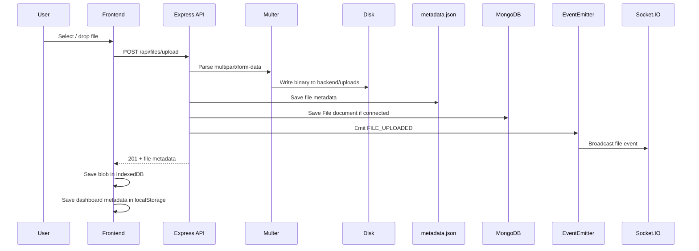

# ☁️ CloudShare — File Sharing App

A browser-based file-sharing application built with **HTML, CSS, Vanilla JavaScript, Node.js, Express, MongoDB/Mongoose, Multer, JWT, bcryptjs, and Socket.IO**.

CloudShare provides a polished dashboard where users can upload files, browse and categorize them, search/filter their files, star items, rename files locally, generate share links, download files, and delete files.

> **Project scope:** CloudShare is currently a learning/demo project. The frontend contains simulated authentication and local browser storage, while the backend provides real file upload/download APIs and optional MongoDB persistence. It should not be treated as a production-secure cloud storage system in its current form.

[📚 Detailed Technical Documentation](DOCUMENTATION.md)

---

## ✨ Features

### File Management
- Drag-and-drop or file-picker upload.
- Backend upload limit of **500 MB per file**.
- Automatic file categorization:
  - Documents
  - Images
  - Media
  - Archives
  - Other
- Grid and list views.
- Search by filename.
- Category filters.
- Star/unstar files.
- Local browser-side rename.
- File deletion.
- Download statistics.
- Shareable browser links.

### Storage
- Uploaded binary files are stored under `backend/uploads/`.
- File metadata is persisted to `backend/uploads/metadata.json`.
- MongoDB can additionally persist file records when the database connection is available.
- Browser `IndexedDB` stores uploaded file blobs for local fallback downloads.
- Browser `localStorage` stores demo authentication and dashboard state.

### Authentication
- Backend registration and login APIs.
- Password hashing with `bcryptjs`.
- JWT generation with seven-day expiry.
- Protected `/api/auth/me` endpoint.
- Frontend login/register pages currently simulate the user session instead of calling the backend authentication routes.

### Real-Time Events
- Socket.IO server attached to the Express HTTP server.
- `FILE_UPLOADED`, `FILE_DOWNLOADED`, and `FILE_DELETED` internal events.
- Broadcast events to connected clients.
- Per-user Socket.IO rooms are supported.

---

## 🏗️ Architecture



### Request flow

```text
Browser
   ↓
frontend/app.js
   ↓
fetch(...)
   ↓
Express server :5001
   ↓
/api/auth  or  /api/files
   ↓
Route handler
   ↓
Authentication / Multer / Metadata logic
   ↓
Disk + metadata.json
   ↓
Optional MongoDB persistence
   ↓
JSON response
```

The backend is a **single Node.js/Express application**, not a set of independently deployed microservices.

---

## 🛠️ Technology Stack

| Layer | Technology |
|---|---|
| Frontend | HTML5, CSS3, Vanilla JavaScript |
| UI | Bootstrap 5.3, Bootstrap Icons |
| Backend | Node.js, Express |
| Uploads | Multer |
| Database | MongoDB with Mongoose |
| Authentication | JWT, bcryptjs |
| Real-time | Socket.IO |
| Configuration | dotenv |
| HTTP | Fetch API |
| Client-side persistence | localStorage, IndexedDB |

---

## 📂 Project Structure

```text
FileSharingApp/
├── backend/
│   ├── config/
│   │   └── db.js                  # MongoDB connection
│   ├── events/
│   │   └── fileEvents.js          # Internal file events
│   ├── middleware/
│   │   └── auth.js                # JWT / demo-user middleware
│   ├── models/
│   │   ├── User.js                # User schema
│   │   └── File.js                # File schema
│   ├── routes/
│   │   ├── auth.js                # Register/login/profile
│   │   └── files.js               # Upload/list/details/download/delete
│   ├── uploads/
│   │   └── metadata.json          # Runtime/persistent metadata
│   ├── index.js                   # Express + Socket.IO entry point
│   ├── package.json
│   └── package-lock.json
│
├── frontend/
│   ├── index.html                 # Landing page
│   ├── login.html                 # Login UI
│   ├── register.html              # Registration UI
│   ├── dashboard.html             # File dashboard
│   ├── share.html                 # Shared-file/download view
│   ├── download.html              # Redirects to share.html
│   ├── app.js                     # Main frontend logic
│   └── style.css                  # Custom styles
│
├── README.md
└── DOCUMENTATION.md
```

---

## 🚀 Getting Started

### Prerequisites

Install:

- Node.js LTS
- npm
- MongoDB (optional for local demo operation; recommended when database persistence is required)

### 1. Clone the repository

```bash
git clone https://github.com/Nilesh1729-cse/FileSharingApp.git
cd FileSharingApp
```

### 2. Install backend dependencies

```bash
cd backend
npm install
```

### 3. Configure environment variables

Create `backend/.env`:

```env
PORT=5001
MONGODB_URI=mongodb://localhost:27017/filesharingapp
JWT_SECRET=replace_with_a_strong_secret
NODE_ENV=development
```

The backend also accepts `MONGO_URI` as an alternative MongoDB variable. If neither URI is supplied, it falls back to the local MongoDB URI in the source.

### 4. Start MongoDB

For a local MongoDB installation:

```bash
mongod
```

MongoDB Atlas or another deployment can be used by setting `MONGODB_URI`.

### 5. Start the backend

```bash
cd backend
npm start
```

The default application port used by the current setup is:

```text
http://localhost:5001
```

Health check:

```text
http://localhost:5001/api/health
```

### 6. Open the frontend

Serve the `frontend` directory with VS Code Live Server or another static file server.

Example:

```text
frontend/index.html
```

> Opening the HTML files directly may work for much of the UI, but serving the folder over HTTP is recommended for a more predictable browser environment.

---

## 📡 API Overview

Base URL:

```text
http://localhost:5001/api
```

### Authentication

| Method | Endpoint | Auth | Purpose |
|---|---|---|---|
| `POST` | `/auth/register` | No | Create a backend user and return JWT |
| `POST` | `/auth/login` | No | Validate credentials and return JWT |
| `GET` | `/auth/me` | Yes* | Return authenticated user profile |

### Files

| Method | Endpoint | Auth | Purpose |
|---|---|---|---|
| `POST` | `/files/upload` | Middleware* | Upload one file |
| `GET` | `/files` | Middleware* | List file metadata |
| `GET` | `/files/:id` | No | Get file details |
| `GET` | `/files/download/:id` | No | Download a file |
| `DELETE` | `/files/:id` | Middleware* | Delete a file |

### System

| Method | Endpoint | Purpose |
|---|---|---|
| `GET` | `/health` | Check whether the API is running |

\*The current `auth` middleware deliberately falls back to a demo/guest user when the token is missing or invalid. See the security section below.

---

## 🔐 Security Notes

The project contains authentication-related code, but some parts are intentionally simplified for demonstration.

### What is implemented

- Password hashing with `bcryptjs`.
- JWT-based backend authentication.
- JWT expiry of seven days.
- MongoDB user model with unique email.
- Authorization header parsing.
- Protected `/api/auth/me` route.

### Important limitations

The current implementation also has several security gaps:

1. Missing or invalid JWTs are converted into a demo/guest identity instead of being rejected.
2. File metadata and download endpoints are public.
3. Delete does not verify file ownership.
4. The `isPublic` and `permissions` fields in the MongoDB file schema are not consistently enforced.
5. CORS is currently permissive.
6. The source contains fallback JWT secrets; production deployments should require a secret through environment configuration.
7. The frontend login/register flows are simulated and currently do not call the backend authentication API.
8. The UI displays encryption-related wording, but the current source does not implement real AES-256 or end-to-end encryption.

For these reasons, CloudShare should be considered a **demo/academic application**, not a secure production file-sharing service.

---

## 💾 Storage Model

CloudShare currently uses three storage layers:

### 1. Server filesystem

```text
backend/uploads/
```

Multer writes uploaded file binaries here.

### 2. Server metadata

```text
backend/uploads/metadata.json
```

The file API records:

- file ID
- stored filename
- original filename
- path
- size
- MIME type
- category
- owner
- status
- public flag
- download count
- creation time

### 3. Optional MongoDB

MongoDB stores `User` and `File` model records when the database connection is active.

The upload route saves metadata to the JSON store first and then attempts a MongoDB save if the connection is ready.

---

## 📊 Dashboard Capabilities

The dashboard supports:

- Storage summary.
- Total file count.
- 50 GB display quota.
- Search.
- Category filters.
- Starred filter.
- Grid/list switching.
- Refresh.
- Upload dropzone.
- Share modal.
- Download.
- Delete.
- Rename.
- Toast notifications.

The **50 GB value is currently a frontend display/storage calculation**, not an enforced server-side quota.

---

## 📁 File Categories

The application derives categories from file extensions and MIME types.

```text
documents
    PDF, DOC, DOCX, TXT, RTF, ODT, XLS, XLSX, PPT, PPTX, CSV

images
    JPG, JPEG, PNG, GIF, SVG, WEBP

media
    MP4, MOV, AVI, MKV, MP3, WAV, FLAC

archives
    ZIP, RAR, TAR, GZ, 7Z, ISO

other
    Everything else
```

---

## 🔄 Upload Flow



### Backend upload limit

The current Multer configuration is:

```text
500 MB per file
```

The frontend contains some promotional UI strings that mention larger limits, but the actual backend enforcement is 500 MB. The backend limit should be treated as authoritative.

---

## ⬇️ Download Flow

The frontend first attempts:

```text
GET /api/files/download/:id
```

When that succeeds:

```text
Server file
   ↓
HTTP response
   ↓
Blob
   ↓
Browser download
```

If the backend request fails, the frontend can fall back to:

```text
IndexedDB blob
       ↓
Browser download
```

For certain demo items without a stored binary, the client-side code may generate fallback content.

The backend also increments the stored metadata download counter when it finds the requested metadata record.

---

## 🔗 Sharing Flow

A share link is generated in the browser in the following form:

```text
/share.html?id=<fileId>&name=<encodedFileName>
```

The share page:

1. Reads the ID/name from the query string.
2. Tries local file metadata first.
3. Falls back to the backend file-details endpoint.
4. Displays file information.
5. Attempts the backend download endpoint.
6. Falls back to the browser-side download mechanism when necessary.

There is currently no server-enforced expiry, access-control token, password protection, or per-recipient permission validation for these links.

---

## ⚡ Real-Time Event Architecture

The backend uses Node.js `EventEmitter` for internal events.

Current event names:

```text
FILE_UPLOADED
FILE_DOWNLOADED
FILE_DELETED
```

The Express server bridges these events to Socket.IO.

Socket clients can join:

```text
user_<userId>
```

rooms.

Events are broadcast globally and, for uploads/deletes, also emitted to the relevant user room when a user ID is available.

This provides the foundation for real-time dashboard/event notifications without introducing a separate message broker.

---

## 🧪 Testing the API with cURL

### Register

```bash
curl -X POST http://localhost:5001/api/auth/register \
  -H "Content-Type: application/json" \
  -d "{\"name\":\"John Doe\",\"email\":\"john@example.com\",\"password\":\"Password123!\"}"
```

### Login

```bash
curl -X POST http://localhost:5001/api/auth/login \
  -H "Content-Type: application/json" \
  -d "{\"email\":\"john@example.com\",\"password\":\"Password123!\"}"
```

Copy the returned token.

### Get profile

```bash
curl http://localhost:5001/api/auth/me \
  -H "Authorization: Bearer YOUR_TOKEN"
```

### Upload a file

```bash
curl -X POST http://localhost:5001/api/files/upload \
  -H "Authorization: Bearer YOUR_TOKEN" \
  -F "file=@./example.pdf"
```

### List files

```bash
curl http://localhost:5001/api/files \
  -H "Authorization: Bearer YOUR_TOKEN"
```

### Get file details

```bash
curl http://localhost:5001/api/files/FILE_ID
```

### Download

```bash
curl -L http://localhost:5001/api/files/download/FILE_ID \
  -o downloaded-file
```

### Delete

```bash
curl -X DELETE http://localhost:5001/api/files/FILE_ID \
  -H "Authorization: Bearer YOUR_TOKEN"
```

---

## 🧩 Backend Module Responsibilities

| File | Responsibility |
|---|---|
| `backend/index.js` | Express server, middleware, route mounting, Socket.IO, health endpoint, error handler |
| `backend/config/db.js` | MongoDB/Mongoose connection |
| `backend/routes/auth.js` | Registration, login, profile |
| `backend/routes/files.js` | File upload/list/details/download/delete |
| `backend/middleware/auth.js` | JWT parsing and demo identity fallback |
| `backend/models/User.js` | User schema |
| `backend/models/File.js` | File schema and permissions metadata |
| `backend/events/fileEvents.js` | Internal file event emitter |
| `backend/uploads/metadata.json` | File metadata persistence |
| `backend/uploads/` | Physical uploaded binaries |

---

## 🎨 Frontend Module Responsibilities

### `index.html`
Landing/marketing page with:

- feature presentation
- navigation
- call-to-action buttons
- product-style UI

### `login.html`
Login UI, password visibility toggle, demo credential helper, and simulated sign-in.

### `register.html`
Registration UI, password confirmation, and password-strength visualization.

### `dashboard.html`
Main file-management interface.

### `share.html`
Shared-file details and download page.

### `download.html`
Redirects to `share.html` while preserving query parameters.

### `app.js`
Central frontend application logic, including:

- authentication state
- localStorage
- IndexedDB
- upload handling
- file rendering
- filters
- search
- download
- share-link generation
- rename
- star toggle
- toast notifications

### `style.css`
Custom CloudShare UI styling on top of Bootstrap.

---

## 🧠 Data Model

### User

```text
User
├── name
├── email (unique)
├── password
├── createdAt
└── updatedAt
```

### File

```text
File
├── filename
├── originalName
├── path
├── size
├── mimetype
├── category
├── owner → User
├── isStarred
├── isPublic
├── downloads
├── permissions[]
└── status
```

Allowed status values:

```text
uploading
available
failed
```

Allowed permission types:

```text
read
write
```

These schema fields provide a basis for access-control features, but the current API does not enforce them comprehensively.

---

## 🩺 Health Check

The backend exposes:

```text
GET /api/health
```

Example:

```json
{
  "status": "ok",
  "message": "CloudShare File Sharing API is running",
  "timestamp": "..."
}
```

Use this endpoint first when troubleshooting frontend/backend connectivity.

---

## ⚠️ Known Limitations

This repository intentionally contains demo-oriented behavior.

### Authentication
- Frontend login/register are simulated.
- Backend auth exists separately.
- Invalid/missing JWTs fall back to a demo identity.

### Authorization
- Public file details/download routes.
- Delete is not ownership-checked.
- `isPublic` and `permissions` are not consistently enforced.

### Storage
- Server metadata is maintained in a JSON file.
- MongoDB persistence is optional.
- Frontend also keeps its own file state in localStorage and IndexedDB.

### Encryption
- No actual end-to-end/AES-256 implementation is present in the current code.
- Security-related UI labels should therefore be considered presentation/demo content.

### Limits
- Backend upload limit: 500 MB per file.
- Frontend marketing text mentions larger values in some places; those values are not enforced by the backend.

### Sharing
- Links do not expire.
- No password-protected share links.
- No recipient-specific access control.

---

## 🔮 Recommended Production Improvements

A production-ready version could evolve toward:

```text
Frontend
   ↓
HTTPS + API Gateway
   ↓
Authentication / Authorization
   ↓
File Service
   ├── Object Storage (S3 / MinIO)
   ├── Metadata DB
   ├── Access-Control Layer
   └── Audit Log
```

Recommended upgrades:

- Strict JWT rejection for missing/invalid tokens.
- Server-side ownership checks.
- Enforce `isPublic` and `permissions`.
- Signed/expiring download URLs.
- Password-protected share links.
- Object storage instead of local filesystem.
- Virus/malware scanning.
- Rate limiting.
- File-type and content validation.
- Strong secrets through environment/configuration management.
- HTTPS.
- Server-side storage quotas.
- Streaming downloads for large files.
- Chunked/resumable uploads.
- Persistent download audit logs.
- Real encryption implementation when promised by the UI.

---

## 🗣️ Viva / Interview Explanation

> **CloudShare is a full-stack file-sharing application built using Vanilla JavaScript on the frontend and Node.js with Express on the backend. The application uses Multer to accept multipart file uploads, stores the binary file in the server's uploads directory, and keeps file metadata in a JSON store, with optional MongoDB persistence through Mongoose.**
>
> **The backend exposes authentication APIs using bcryptjs for password hashing and JWT for authentication. It also provides APIs for uploading, listing, viewing, downloading, and deleting files.**
>
> **On the frontend, localStorage manages the demo login and dashboard metadata, while IndexedDB stores uploaded file blobs for client-side fallback downloads. File management includes search, categories, starring, rename, share links, and grid/list views.**
>
> **For real-time communication, Node's EventEmitter generates file events, and the backend forwards those events through Socket.IO to connected clients and user-specific rooms.**
>
> **The current project is intentionally a demo-oriented architecture. Authentication in the UI is simulated, authorization is not fully enforced, and encryption shown in the interface is not implemented as actual end-to-end encryption. A production version would add strict authorization, signed links, object storage, encryption, validation, rate limiting, and stronger secret management.**

---

## 📚 Documentation

For a deeper explanation of:

- architecture
- authentication flow
- file upload/download pipeline
- MongoDB persistence
- event system
- Socket.IO architecture
- API request/response formats
- data models
- security limitations
- troubleshooting
- production evolution

see:

**[DOCUMENTATION.md](DOCUMENTATION.md)**

---

## 📄 License

The repository currently contains the backend package license metadata as **ISC**. Review/update the repository-level licensing before distributing the project under a different license.

---

## 👨‍💻 Repository

**GitHub:**  
https://github.com/Nilesh1729-cse/FileSharingApp
